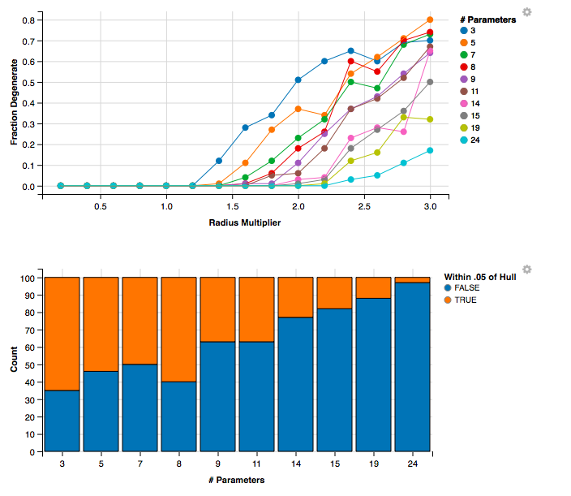

A selection of `Shiny` applications to accompany the paper "An exposition on the propriety of restricted Boltzmann machines" by <a href="http://andeekaplan.com">Andee Kaplan</a>, <a href="http://dnordman.public.iastate.edu/">Daniel Nordman</a>, and <a href="http://www.public.iastate.edu/~vardeman/">Stephen Vardeman</a>, all in the Department of Statistics at Iowa State University. All code is available on <a href="http://github.com/andeek/deep-learning">GitHub</a>.

<h4>$\mu$-parameterization</h4>

Explore the behavior of the $\mu$-parametrized parameters for various dimensional RBMs.

<h4>$\mu$-parameterization in 3 dimensions</h4>

For one hidden and one visible node, sample points uniformly on a 3 dimensional sphere of radius `r` centered at `(0,0,0)` and view the resulting expected values in 3 dimensions.

<h4>Degeneracy and parameter magnitude</h4>

What is the relationship between parameter magnitude and near-degeneracy?

<h4>Degeneracy, instability, and uninterpretability... Oh my!</h4>

The highly flexible nature of the RBM ($H + V + HV$ parameters) makes three characteristics of model impropriety of particular concern.

