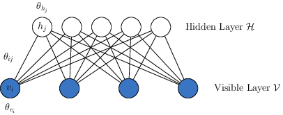
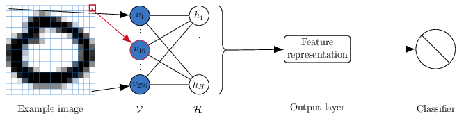
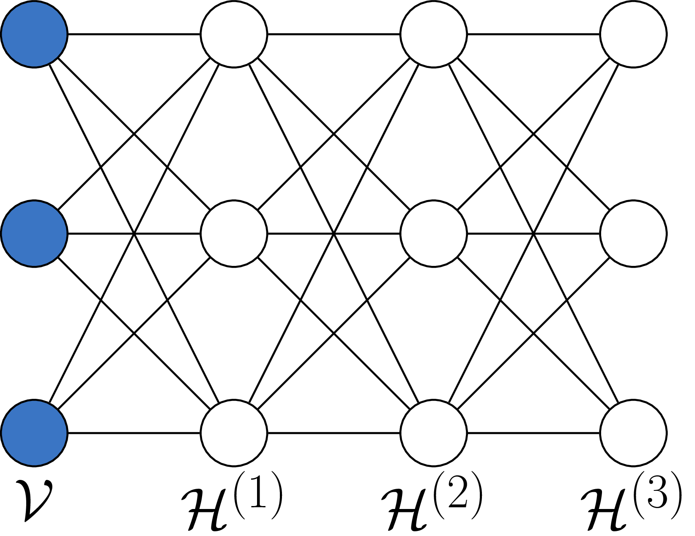
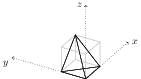

```{r libraries, echo=FALSE, message=FALSE, warning=FALSE}
library(knitr)
library(ggplot2)
library(dplyr)
library(tidyr)

opts_chunk$set(echo=FALSE, message=FALSE, warning=FALSE)
theme_set(theme_bw(base_family="serif"))

source("../../writing/helpers/functions.R")
```


## An exposition on the propriety of restricted Boltzmann machines { .white }


<p class="white">
Andee Kaplan, Daniel Nordman, and Stephen Vardeman<br/>
Iowa State University<br/>
July 31, 2016<br/>
JSM - Chicago, IL<br/>
</br></br></br></br>
<a href="http://bit.ly/jsm2016-rbm">http://bit.ly/jsm2016-rbm</a>
</p>

# Restricted Boltzmann machines

## What is this?

<div class="double">
<p class="double-flow">
Restricted Boltzmann machine (RBM) with two layers - hidden ($\mathcal{H}$) and visible ($\mathcal{V}$) [@friedman2001elements].
</p>
<p class="double-flow">
</br>
</p>
</div>
</br>
Used for image classification. Each image pixel is a node in the visible layer. The output creates features, passed to supervised learning.

## Joint Distribution

Let $x = \{h_1, ..., h_H, v_1, ...,v_V\}$ represent the states of the visible and hidden nodes in an RBM. Then the probability each node taking the the value corresponding to $x$ is:

$$
f_{\theta} (x) = \frac{\exp\left(\sum\limits_{i = 1}^V \sum\limits_{j=1}^H \theta_{ij} v_i h_j + \sum\limits_{i = 1}^V\theta_{v_i} v_i + \sum\limits_{j = 1}^H\theta_{h_j} h_j\right)}{\sum\limits_{x \in \mathcal{X}}\exp\left(\sum\limits_{i = 1}^V \sum\limits_{j=1}^H \theta_{ij} v_i h_j + \sum\limits_{i = 1}^V\theta_{v_i} v_i + \sum\limits_{j = 1}^H\theta_{h_j} h_j\right)}
$$

## Deep learning


<div class="double">
<p class="double=flow">
"Deep Boltzmann machine" - multiple single layer restricted Boltzmann machines with the lower stack hidden layer acting as the visible layer for the higher stacked model
</p>
<p class="double-flow">
</br>
</p>
</div><br/>

Claimed ability to learn "internal representations that become increasingly complex" [@salakhutdinov2009deep], used in classification problems.

# Degeneracy, instability, and uninterpretability. Oh my!

## Near-degeneracy

The highly flexible nature of the RBM ($H + V + HV$ parameters) makes three characteristics of model impropriety of particular concern. 

Let $Q(\cdot)$ denotes the neg-potentional function of the model, having support set $\mathcal{S}$.


| Characteristic | Detection |
|:----------------------------------------------------------------|:-------------------------------------------------------|
|Disproportionate amount of probability placed on only a few elements of the sample space by the model [@handcock2003assessing] | If random variables in $Q(\cdot)$ have a collective mean $\mu(\theta)$ close to the boundary of the convex hull of $\mathcal{S}$. |

## Instability

Let $R(\theta) = \max_{v} \max_{h}Q(x) - \min_{v}\max_{h}Q(x) - H\log 2$.

| Characteristic | Detection |
|:----------------------------------------------------------------|:-------------------------------------------------------|
| Small changes in natural parameters result in large changes in probability masses, excessive sensitivity [@schweinberger2011instability]. | If $R(\theta)/V$ is large, then the the maximum log-likelihood ratio of two images that differ in only one pixel is large. |


## Uninterpretability

| Characteristic | Detection |
|:----------------------------------------------------------------|:-------------------------------------------------------|
| Due to the existence of dependence, marginal mean-structure no longer maintained [@kaiser2007statistical]. | If the magnitude of the difference between model expectations and expectations under independence (dependence parameters of zero), $\left\vert E( X \vert \theta) -E( X \vert \emptyset ) \right\vert$, is large. |


## Data coding to mitigate degeneracy

<div class="double">
<p class="double-flow">

</p>
<p class="double-flow">

</p>
</div>

Convex hulls of the statistic space for a toy RBM with $V = H = 1$ for $\{0,1\}$ and $\{-1,1\}$-encoding enclosed by an unrestricted hull of 3-space.

## Data coding to mitigate degeneracy (cont'd)

- For the $\{-1, 1 \}$ encoding of $\mathcal{V}$ and $\mathcal{H}$, the origin is the center of the parameter space
- At $\theta = 0$, the RBM is equivalent to elements of $X$ being distributed as iid Bernoulli$\left(\frac{1}{2}\right)$ $\Rightarrow$ No *near-degeneracy*, *instability*, or *uninterpretability*!


```{r encoding-volume, echo = FALSE, fig.height=3}
test_cases <- expand.grid(data.frame(1:4)[,rep(1,2)]) %>% 
  rename(H = X1.4, V = X1.4.1) %>%
  filter(H <= V) %>% #remove those cases with less visibles than hiddens. Is this necessary?
  mutate(n_param = H*V + H + V) %>%
  mutate(max_facets = (2^(H+V))^(floor(n_param/2))) %>%
  filter(n_param <= 11) #calc_hull can't handle any higher dimensions currently

bin_res <- plyr::dlply(test_cases, plyr::.(n_param), function(x) calc_hull(x$V, x$H, "binary"))
neg_res <- plyr::dlply(test_cases, plyr::.(n_param), function(x) calc_hull(x$V, x$H, "negative"))

plyr::ldply(bin_res, function(x) x$c_hull$vol) %>% 
  mutate(frac_vol = V1/(1^n_param)) %>%
  inner_join(plyr::ldply(neg_res, function(x) x$c_hull$vol) %>% 
               mutate(frac_vol = V1/(2^n_param)),
             by="n_param") %>%
  rename(vol.bin = V1.x, vol.neg = V1.y, frac_vol.bin = frac_vol.x, frac_vol.neg = frac_vol.y) %>%
  gather(vars, value, -n_param) %>%
  separate(vars, c("type", "encoding"), "\\.") %>%
  spread(type, value) %>%
  ggplot() +
  geom_point(aes(x=n_param, y=frac_vol, colour=encoding)) +
  geom_line(aes(x=n_param, y=frac_vol, colour=encoding, group=encoding)) +
  ylab("Fraction of unrestricted volume") +
  xlab("Number of parameters") +
  scale_colour_discrete("Encoding", labels=c("Binary (1,0)", "Negative (1,-1)")) +           
  theme(
    plot.background = element_rect(fill = "transparent", colour = NA),
    legend.background = element_rect(fill = "transparent", colour = NA)) -> p

p
```


## Manageable (a.k.a. small) examples

```{r three-ways, cache=TRUE, echo=FALSE}
#reshape data functions
plot_data <- function(res, grid = FALSE) {
  
  plot.data <- data.frame()
  
  if(!grid) {
    for(i in 1:nrow(res)) {
      tmp <- res$g_theta[[i]] %>% data.frame()
      H <- res[i,]$H
      V <- res[i,]$V
      N <- res[i,]$N
      r1 <- res[i,]$r1
      r2 <- res[i,]$r2
      C <- res[i,]$C
      epsilon <- res[i,]$epsilon
      
      
      tmp %>% 
        rowwise() %>% 
        mutate_(ss_interaction = paste0("(", paste(paste0(names(.)[(H + V + 1):(H + V + H*V)], "^2"), collapse = " + "), ")"),
                ss_main = paste0("sum(", paste(paste0(names(.)[1:(H+V)],"^2"), collapse = " + "), ")")) %>%    
        ungroup() -> ratio
      
      
      inner_join(ratio, res$outside[[i]] %>% ungroup()) %>%
        select(ss_interaction, ss_main, near_hull) %>%
        mutate(H = H, V = V, n_param = H + V + H*V, N = H + V, N = N, r1 = r1, r2 = r2, C = C, epsilon = epsilon) %>%
        rbind(plot.data) -> plot.data
    }
  } else {
    for(i in 1:nrow(res)) {
      tmp <- res$g_theta[[i]] %>% data.frame()
      H <- res[i,]$H
      V <- res[i,]$V
      N <- res[i,]$N
      r1 <- res[i,]$r1
      r2 <- res[i,]$r2
      
      tmp %>% 
        rowwise() %>% 
        mutate_(ss_interaction = paste0("(", paste(paste0(names(.)[(H + V + 1):(H + V + H*V)], "^2"), collapse = " + "), ")"),
                ss_main = paste0("sum(", paste(paste0(names(.)[1:(H+V)],"^2"), collapse = " + "), ")")) %>%  
        ungroup() -> ratio
      
      
      inner_join(ratio, res$outside[[i]] %>% ungroup()) %>%
        select(ss_interaction, ss_main, near_hull) %>%
        mutate(H = H, V = V, n_param = H + V + H*V, N = H + V, N = N, r1 = r1, r2 = r2) %>%
        rbind(plot.data) -> plot.data
    }
  }
  
  return(plot.data)
}
indep_params <- function(samp, H, V) {
  samp[, (H + V + 1):ncol(samp)] <- 0
  samp
}
max_Q <- function(theta, stats) {
  apply(crossprod(t(stats), theta), 2, max)
}
min_Q <- function(theta, stats) {
  apply(crossprod(t(stats), theta), 2, min)
}
min_max_Q <- function(theta, stats) {
  require(dplyr)
  tcrossprod(stats, theta) %>% data.frame() %>%
    cbind(stats) %>%
    group_by_(.dots = colnames(stats)[grepl("v", colnames(stats)) & !grepl("theta", colnames(stats))]) %>%
    summarise_each(funs(max), contains("X")) %>%
    ungroup() %>%
    summarise_each(funs(min), contains("X")) %>%
    select(contains("X")) %>%
    data.matrix() %>%
    t()
}


#grid data
load("../../writing/data/results_grid.RData")

#near-degeneracy
plot_dat_grid <- res %>% plot_data(grid = TRUE)

plot_dat_grid %>%
  group_by(r1, r2, H, V) %>%
  summarise(frac_degen = sum(near_hull)/n(), count = n()) %>% 
  ungroup() %>% 
  mutate(Hiddens = paste0("H: ", H), Visibles = paste0("V: ", V)) -> convex_hull_summary

#uninterpretability
res %>%
  group_by(H, V, N, r1, r2) %>%
  do(indep_exp = t(expected_value(t(indep_params(.$samp[[1]], .$H, .$V)), .$stat[[1]]))[, -((.$H + .$V + 1):(.$H + .$V + .$H*.$V))],
     marg_exp = .$g_theta[[1]][, (.$H + .$V + .$H*.$V + 1):(ncol(.$g_theta[[1]])-.$H*.$V)]) -> exp_vals

exp_vals %>%
  group_by(H, V, N, r1, r2) %>%
  do(data.frame(max_abs_diff = apply(abs(.$indep_exp[[1]] - .$marg_exp[[1]]), 1, max))) %>%
  group_by(H, V, N, r1, r2) %>%
  summarise(max_abs_diff = mean(max_abs_diff)) %>%
  mutate(Hiddens = paste0("H: ", H), Visibles = paste0("V: ", V)) -> exp_vals_summary

#instability
res %>%
  group_by(H, V, N, r1, r2) %>%
  do(data.frame(max = max_Q(t(.$samp[[1]]), .$stat[[1]]),
                min = min_Q(t(.$samp[[1]]), .$stat[[1]]),
                min_max = min_max_Q(.$samp[[1]], .$stat[[1]]))) %>%
  ungroup() %>% 
  group_by(H, V, N, r1, r2) %>%
  mutate(LHS1 = (max - min)/N,
         LHS2 = (max - min_max - H*log(2))/N) %>%
  summarise_each(funs(mean), LHS1, LHS2) -> max_q_summary


convex_hull_summary %>%
  left_join(max_q_summary) %>%
  left_join(exp_vals_summary) -> three_ways
```
```{r degen-plots, echo=FALSE}
three_ways %>%
  mutate(r1 = round(r1/(H + V), 8), r2 = round(r2/(H * V), 8)) %>% 
  ggplot() +
  geom_tile(aes(x = r1, y = r2, fill = frac_degen)) +
  geom_contour(aes(x = r1, y = r2, z = frac_degen), colour = "black", bins = 8) +
  geom_contour(aes(x = r1, y = r2, z = frac_degen), colour = "black", breaks = .05, size = 1.5) +
  geom_abline(aes(intercept = 0, slope = 1), alpha = .5, lty = 2) +
  scale_fill_gradient("Fraction near-degenerate", low = "yellow", high = "red") +
  facet_grid(Visibles~Hiddens) +
  xlab(expression(paste(group("||", theta[main], "||"), "/(H + V)"))) +
  ylab(expression(paste(group("||", theta[interaction], "||"), "/(H*V)"))) +
  theme(aspect.ratio = 1) +
  theme(legend.position = "bottom") +
  ggtitle("Near-degeneracy") -> p.degen

three_ways %>%
  mutate(r1 = round(r1/(H + V), 8), r2 = round(r2/(H * V), 8)) %>% 
  ggplot() +
  geom_tile(aes(x = r1, y = r2, fill = max_abs_diff)) +
  geom_contour(aes(x = r1, y = r2, z = max_abs_diff), colour = "black", bins = 8) +
  #geom_contour(aes(x = r1, y = r2, z = mean_abs_diff), colour = "black", breaks = .05, size = 1.5) +
  geom_abline(aes(intercept = 0, slope = 1), alpha = .5, lty = 2) +
  scale_fill_gradient(expression(group("|", E(group("", bold(X), "|")*bold(theta)) - E(group("", bold(X), "|")*symbol("\306")), "|")), low = "yellow", high = "red", limits = c(0,2)) +
  facet_grid(Visibles~Hiddens) +
  xlab(expression(paste(group("||", theta[main], "||"), "/(H + V)"))) +
  ylab(expression(paste(group("||", theta[interaction], "||"), "/(H*V)"))) +
  theme(legend.position = "bottom") +
  ggtitle("Uninterpretability") +
  theme(aspect.ratio = 1) -> p.exp_diff


three_ways %>%
  mutate(r1 = round(r1/(H + V), 8), r2 = round(r2/(H * V), 8)) %>% 
  ggplot() +
  geom_tile(aes(x = r1, y = r2, fill = LHS2)) +
  geom_contour(aes(x = r1, y = r2, z = LHS2), colour = "black", bins = 8) +
  #geom_contour(aes(x = r1, y = r2, z = mean_max_q), colour = "black", breaks = .05, size = 1.5) +
  geom_abline(aes(intercept = 0, slope = 1), alpha = .5, lty = 2) +
  scale_fill_gradient(expression(frac(R(theta), V)), low = "yellow", high = "red") +
  facet_grid(Visibles~Hiddens) +
  xlab(expression(paste(group("||", theta[main], "||"), "/(H + V)"))) +
  ylab(expression(paste(group("||", theta[interaction], "||"), "/(H*V)"))) +
  theme(aspect.ratio = 1) +
  theme(legend.position = "bottom") +
  ggtitle("Instability") -> p.min_max_q
```

```{r, fig.hold=TRUE, fig.width=3, out.width='33%'}
p.degen
p.min_max_q
p.exp_diff
```
RBMs easily are *near-degenerate*, *unstable*, and *uninterpretable* for large portions of parameter space. 

# Bayesian model fitting

## A tale of three methods

> 1. *Trick prior.* Cancel out the normalizing term, full conditionals normally dist'd. 
   $$
    \pi(\theta) \propto \gamma(\theta)^n \exp\left(-\frac{1}{2C_{1}} \theta_{main}' \theta_{main} -\frac{1}{2C_{2}} \theta_{int}' \theta_{int}\right),
   $$
    where $\gamma(\theta)$ is the normalizing term [@li2014biclustering].
> 2. *Truncated Normal prior.* Use two independent truncated spherical normal distributions as priors for $\theta_{main}$ and $\theta_{int}$ with $\sigma_{int} < \sigma_{main}$. Not conjugate $\Rightarrow$ geometric adaptive MH step [@zhou2014some] and calculation of $\gamma(\theta)$. 
> 3. *Marginalized likelihood* Marginalize out $h$ in $f_{\theta}(x)$, use trunc. Normal prior. 
    $$
    g_{ \theta}(v) = \sum\limits_{\in \{-1,1\}^H} \exp\left(\sum\limits_{i = 1}^V \sum\limits_{j=1}^H \theta_{ij} v_i h_j + \sum\limits_{i = 1}^V\theta_{v_i} v_i + \sum\limits_{j = 1}^H\theta_{h_j} h_j\right)
    $$

## Posterior distributions of images

```{r models, cache=TRUE}
source("../../4x4 model/functs_sample.R")

#data and params ------------------------
H <- 4
V <- 4

#marginalized likelihood
load("../../4x4 model/written/fitted_models_trunc_marginal_thin.Rdata")
marginal_bad <- models_bad
marginal_good <- models_good

#load trick prior
load("../../4x4 model/written/fitted_models_jing_5.8.Rdata")
trick_bad <- models_bad
trick_good <- models_good

#truncated normal
load("../../4x4 model/written/fitted_models_trunc_thin.Rdata")
trunc_bad <- models_bad
trunc_good <- models_good

#rm unneccesary data
rm(models_bad)
rm(models_degen)
rm(models_good)

load("../../4x4 model/written/params_theta.Rdata")

params_good <- list(main_hidden = sample.params %>% ungroup() %>% filter(!near_hull) %>% select(starts_with("h"), -H) %>% data.matrix(),
                    main_visible = sample.params %>% ungroup() %>% filter(!near_hull) %>% select(starts_with("v"), -V) %>% data.matrix(),
                    interaction = sample.params %>% ungroup() %>% filter(!near_hull) %>% select(starts_with("theta")) %>% data.matrix() %>% matrix(4))

#computing actual distributions ---------------------
distn_good <- visible_distn(params = params_good)

reshape_sample_distn <- function(model) {
  sample_distn <- model$distn
  dim(sample_distn) <- c(dim(sample_distn)[1]*dim(sample_distn)[2], dim(sample_distn)[3])
  sample_distn %>% data.frame() -> sample_distn
  names(sample_distn) <- names(distn_good)
  
  sample_distn %>%
    group_by(image_id) %>%
    mutate(iter = 1:n()) -> sample_distn
  
  return(sample_distn)
}

marginal_sample_good <- reshape_sample_distn(marginal_good)
trick_sample_good <- reshape_sample_distn(trick_good)
trunc_sample_good <- reshape_sample_distn(trunc_good)

marginal_sample_good %>% rename(marginal = prob) %>%
  left_join(trick_sample_good %>% ungroup() %>% select(-image_id) %>% rename(trick = prob)) %>%
  left_join(trunc_sample_good %>% ungroup() %>% select(-image_id) %>% rename(trunc = prob)) %>%
  ungroup() %>%
  mutate(image_id = paste0("image_", image_id)) %>% 
  gather(method, prob, trick, marginal, trunc) %>%
  spread(image_id, prob) -> all_statistics

all_statistics %>%
  gather(statistic, value, -iter, -method, -starts_with("v")) %>%
  filter(grepl("image", statistic) & !is.na(value)) %>%
  separate(statistic, into = c("junk", "statistic")) %>%
  mutate(statistic = factor(statistic, labels = paste("Image", 1:length(unique(statistic))))) %>%
  left_join(distn_good %>% select(-image_id)) %>% 
  ggplot() +
  geom_density(aes(value, y=..scaled.., colour = method, fill = method), alpha = .2) +
  geom_vline(aes(xintercept = prob)) +
  facet_wrap(~statistic, scales = "free_x") + 
  ylab("Scaled Posterior Density") + xlab("Probability of Image") +
  scale_colour_discrete("Method", labels = c("Marginalized likelihood", "Trick prior", "Truncated Normal prior")) +
  scale_fill_discrete("Method", labels = c("Marginalized likelihood", "Trick prior", "Truncated Normal prior")) -> p.models
```
```{r models-plot, fig.width=8, fig.height=4}
p.models
```
Each of these rigorous fitting methods seeks to merely replicate the empirical data distribution, which is the optimal nonparametric solution.

# Thank you!

## References {.small}